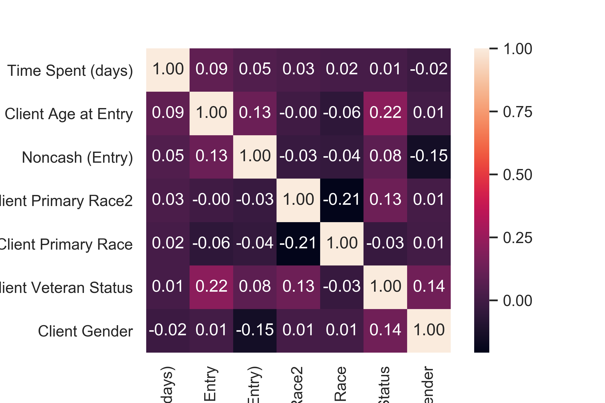
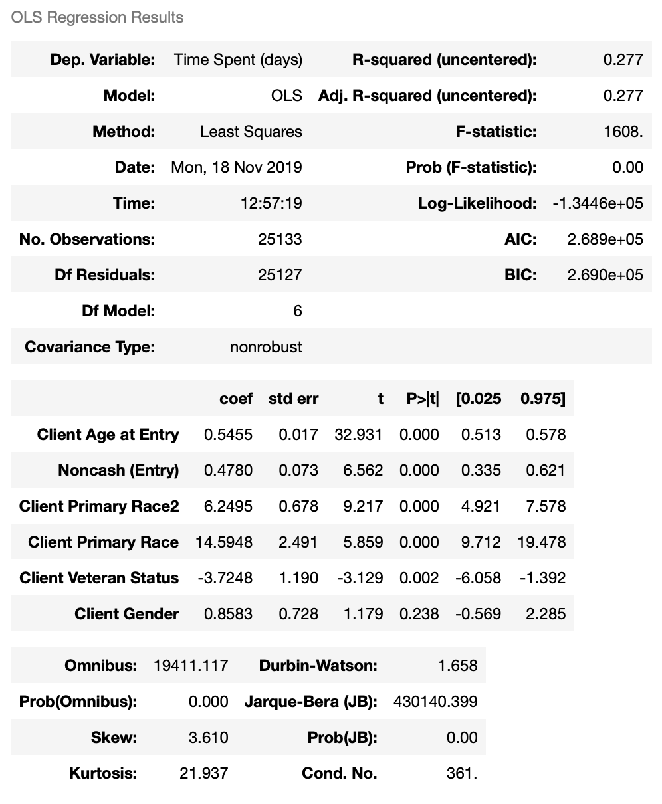

# Background and data source

These datasets are from the shelter side of Urban Ministries of Durham (UMD) who connects with the community to end homelessness and fight poverty by offering food, shelter and a future to neighbors in need. The datasets consist of 16 tables, including information about clients upon entry to and exit from the shelter, such as basic demographics, income, insurance, etc.

The original datasets and few generated datasets during the data processing are available here: https://github.com/datasci611/bios611-projects-fall-2019-Quanbaby/tree/master/project_3/data

# Purpose of the project

This project is conducted to help the shelter side of UMD better offer their amazing services to people in need. Specifically, we will focus on these questions:

1. Some summary statistics about people came to the shelter.

2. Specific analysis for individual client.

3. Relationship between clients staying days and other factors.

4. Any potential changes between entry and exit to decide whether their lives were improved.

# Questions and answers

## 1. Some summary statistics about people came to the shelter.

```{r, echo=FALSE, message=FALSE, warning=FALSE}
library(ggplot2)
library(tidyverse)
client_final = read_tsv("../data/clients_final.tsv")
```

### (1) Summary about EE providers

The summary about EE providers and number of clients (frequencies) they have accepted.

| EE Provider ID | Number |
| -------------- | ------ |
| Urban Ministries of Durham - Durham County - Singles Emergency Shelter - Private(5838) | 4319 |
| XXXClosed2015 Urban Ministries of Durham- Durham County- Journey Entry- ESG(1970) | 721  |
|XXXClosed2015 Urban Ministries of Durham- Durham County- Journey Forward- ESG(5694) |  65 |  
|XXXClosed2015 Urban Ministries of Durham- Durham County- Journey Outreach- ESG(4515) | 51 |
|XXXClosed2015 Urban Ministries of Durham- Durham County- Journey Recovery- ESG(1932) | 67 |
|XXXClosed2015 Urban Ministries of Durham- Durham County- Journey Tech- ESG(4516) | 61 |
|XXXClosed2015 Urban Ministries of Durham- Durham County- Journey Veterans- ESG(5069) | 15 |

This result shows that there were 7 different providers, but it seems that only the first one (which is also the major one) is still open from the names of other providers.

### (2) Summary about clients genders

The summary about clients' genders and number of clients (frequencies) in each gender.

| Client Gender | Number |
| ------------- | ------ |
| Female | 1290 |
| Male | 3989 |
|Trans Female (MTF or Male to Female) | 17 |


```{r, echo=FALSE, message=FALSE, warning=FALSE, fig.align='center'}
ggplot(client_final %>% select(`Client Gender`) %>% drop_na(), mapping = aes(`Client Gender`)) + 
  geom_bar() + 
  labs(title = "Barplot for clients gender")
```

From both the summary statistics and plot we know that most clients came to the shelter were male (~80%). There were also few trans females clients.

### (3) Summary about clients ages


```{r, echo=FALSE, message=FALSE, warning=FALSE, fig.align='center'}
ggplot(client_final, mapping = aes(`Client Age at Entry`)) + 
  geom_density() + 
  labs(title = "Density for client age at entry")
```

From the plot we know most of the clients were ~50 years old, but there was a peak at ~22 years old. 

### (4) Summary about clients races

The summary about clients' races and number of clients (frequencies) in each race.

| Client Primary Race | Number |
| ------------------- | ------ |
| American Indian or Alaska Native (HUD) | 90 |
| Asian (HUD) | 3 |
| Black or African American (HUD) | 864 |
| Client doesn't know (HUD) | 4 |
| Client refused (HUD) | 5 |
| Data not collected (HUD) | 6 |
| Native Hawaiian or Other Pacific Islander (HUD) | 1 |
| White (HUD) | 1313 |

Most of the clients were black and white, with few minorities. 


### (5) Summary about clients veteran status

The summary about clients' veteran status and number of clients (frequencies) in each catogory.

| Client Veteran Status | Number |
| --------------------- | ------ |
| Data not collected (HUD) | 7 |
| No (HUD) | 4724 |
| Yes (HUD) | 558 |

```{r,echo=FALSE, message=FALSE, warning=FALSE, fig.align='center' }
ggplot(client_final %>% select(`Client Veteran Status`) %>% drop_na(), mapping = aes(`Client Veteran Status`)) + 
  geom_bar() + 
  labs(title = "Barplot for clients veteran status")
```

About ~10% of the clients were veterans.

### (6) Summary about reasons people left.

The summary about clients' left reasons (destinations) and number of clients (frequencies) in each catogory.

| Destinations | Number |
| ------------ | ------ |
| Staying or living with friends, temporary tenure | 1443 |
| No exit interview completed | 985 |
| Staying or living with family, temporary tenure | 840 |
| Data not collected | 313 |
| Rental by client, no ongoing housing subsidy | 292 |
| Other | 278 |
| Staying or living with family, permanent tenure | 166 |
| Hospital or other residential non-psychiatric medical facility | 164 |
| Rental by client, with other ongoing housing subsidy | 157 |
| Place not meant for habitation | 147 |
| Staying or living with friends, permanent tenure | 84 |
| Jail, prison or juvenile detention facility | 49 |
| Rental by client, with RRH or equivalent subsidy | 45 |
| Psychiatric hospital or other psychiatric facility | 40 |
| Emergency shelter, incl. hotel/motel paid for w/ ES voucher, or RHY-funded Host Home shelters | 35 |
| Permanent housing (other than RRH) for formerly homeless persons | 33 |
| Transitional housing for homeless persons (including homeless youth) | 30 |
| Hotel or motel paid for without emergency shelter voucher | 19 |
| Substance abuse treatment facility or detox center | 17 |
| Rental by client, with VASH housing subsidy | 15 |
| Client doesn't know | 9 |
| Residential project or halfway house with no homeless criteria | 8 |
| Owned by client, no ongoing housing subsidy | 5 |
| Long-term care facility or nursing home | 5 |
| Client refused | 4 |
| Deceased | 3 |
| Safe Haven | 3 |
| Owned by client, with ongoing housing subsidy | 2 |
| Rental by client in a public housing unit | 1 |

Most people left because they would gonna stay with friends for temporary tenure. 

## 2. Specific analysis for individual client.
### (1) Who came most often.

| Client ID | Frequencies |
| --------- | ----------- |
| 320781 | 37 |
| 344697 | 36 |
| 2054 | 22 |
| 419124 | 18 |
| 346065 | 18 |

CLient 320781 came most frequently with 37 times, following by client 344697 with 36 times.

### (2) Who stayed the longest.

| Client ID | Time Spent (days) |
| --------- | ----------------- |
| 231922 | 894 |
| 10107 | 574 |
| 224787 | 550 |
| 318721 | 515 |
| 318722 | 515 |


Cient 231922 spent 894 days (more than 2 years) in one visit.

## 3. Relationship between clients staying days and other factors.
### (1) Density of clients staying days.

```{r,echo=FALSE, message=FALSE, warning=FALSE, fig.align='center'}
ggplot(client_final, mapping = aes(`Time Spent (days)`)) + 
  geom_density() + 
  labs(title = "Density for days client spent in shelter")
```

From the above plot, most people stayed for less than 250 days. To better see the details, we zoom in the plot in the (0, 250) interval.

```{r, echo=FALSE, message=FALSE, warning=FALSE, fig.align='center'}
ggplot(client_final %>% filter(`Time Spent (days)`<250), mapping = aes(`Time Spent (days)`)) + 
  geom_density() + 
  labs(title = "Density for days client spent in shelter (zoomed in)")
```

We can see from the plot that most people stayed for quite a short time (~10 days). It's consistent with the most common reason that people left: stay with friend temporarily. Some clients may came to the shelter for temporary housing, and then would move out after contacting a friend who would house him/her.


### (2) Fit a regression model for clients staying days

We then want fit a regression model where the response variable is client staying days. The first question is about the explanotory varialbes. Potential explanotory variables are client age at entry, client gender, client race, client veteran status, client income at entry, client insurance types at entry, clinet noncash services at entry, client disabilities at entry. We first convert the catogorical data to numricals.

#### a. Converting data to numerical
The catogorical data in this context are the variables shown above except for age and income. The original datasets recording variables such as insurance were divided by different types of insurance, for example. Therefore we should count the number of insurance types for each visit. Repeat the same thing for noncash services and disabilities, also do similar thing for client income by summing up the values of different income sources. Then those variables are numerical.

Then we try to deal with gender, veteran status and race. We use dummy variable, set female equals 0 and male equals 1. Similarly give veteran status Yes value 1 and No value 0. As to the race, since the majority were black and white, we gathered other races in the same group, and using two-dimensional dummy variables to represent it. Let White be (0,0), black be (0,1) and others be (1,0). Till now, all the variables are ready. 

#### b. Decide which varaibles should be considered
Then the next question is, should we use all the variables above in the model? Thus we calculate the pearson correlation matrix and select the highest 6 variables correlated with the response variable. The heatmap of correlation matrix is shown below:



Therefore, we choose client age at entry, noncash services at entry, client primary race, client primary race2, client veteran status and client gender as model variables.

#### c. Fit the model
We use OLS function in statsmodels.api package in python to fit a regression model. The model summary result is shown below:



The model R square is 0.277 which means the model is relatively bad. It's reasonable since the length that people wanted to stay is really subjective. It is nearly impossible to be well-fitted. But using this model, we can see in general,

1. veterans tended to stay in the shelter shorter than non-veterans,

2. older people tended to stay in the sheleter longer than younger people,

3. Black people tended to stay in the shelter longer than white people.


#### d. Visualization about relationships between days spent and other variables.
##### i. Days spent vs. age/gender
```{r,echo=FALSE, message=FALSE, warning=FALSE, fig.align='center' }
ggplot(client_final %>% filter(`Time Spent (days)`<750),  # remove one outlier 
       mapping = aes(x = `Client Age at Entry`, y = `Time Spent (days)`, 
                        group = `Client Gender`, color = `Client Gender`, legend = `Client Gender`  )) + 
  geom_violin() + 
  theme(legend.text = element_text(size = 8), legend.position = 'bottom') + 
  labs(title = "Violin plot for staying days and age/gender")
```

It could be seen from the plot that male consists of a large proportion of the clients, and people at about 50 years old tended to stay the longest. The peak for male is younger and higher than that for female.


##### ii. Days spent vs. income at entry
```{r,echo=FALSE, message=FALSE, warning=FALSE, fig.align='center' }
ggplot(client_final,
       mapping = aes(x = `Monthly Amount (Entry)`, y = `Time Spent (days)`)) + 
  geom_point() + 
  labs(title = "Scatter plot for staying days and income at entry")
```

From the scatter plot we can see that people with higher monthly income amount tended to stay shorter, which is reasonable.


##### iii. Days spent vs. insurace
```{r,echo=FALSE, message=FALSE, warning=FALSE, fig.align='center' }
ggplot(client_final %>% filter(`Insurance (Entry)` < 30),
       mapping = aes(x = `Insurance (Entry)`, y = `Time Spent (days)`)) + 
  geom_point() + 
  labs(title = "Scatter plot for staying days and insurance at entry")
```

From the scatter plot we can see that people with more insurance covered tended to stay shorter, which is reasonable.


## 4. Changes between entry and exit to decide whether their lives were improved.

First we create variables to denote the changes after clients staying in the shelter for a while. They are differences about income, insurance, noncash services and disabilities. Then we create a score to use the one numerical value representing the level of change of each client's living condition. The formula is given below:

$$ \text{Score} = 0.0004 \times \text{Income diff} + 0.4 \times \text{Insurance diff} + 0.4 \times \text{Noncash diff} - 0.2 \times \text{Disability diff} $$

The reason we give "Income diff" weight $0.0004$ is that the values of income difference are around ~1000. This weight may avoid the case that this variable is the dominant one amoung the four variables.

The average score of visits are $0.098$, and $5690$ frequency visits out of $25454$ have improved. The density of score is shown as below:

```{r,echo=FALSE, message=FALSE, warning=FALSE, fig.align='center'}
client_diff = read_tsv("../data/clients_diff.tsv")
ggplot(client_diff %>% drop_na(Score),
       mapping = aes(Score )) + 
  geom_density() + 
  labs(title = "Density for Score")
```


# Conclusion

In this project, we first got some summary statistics about the clients went to the shelters. Then we got some information regarding of who came most often and who stayed in the shelter for the longest time. We expected that the client coming most often will appear some times in the future. After that, our main focus is the days people spent in the shelter. We visualized the density of staying days and then fitted a model to describe any potential factors affecting it. Since the decision of staying or leaving is really objective, the model performed not well as expected. But it's still helpful for some analysis. Finally, we created a score to represent the living conditions changed after staying in the shelter for a while. Generally speaking, the clients' lives didn't change much, with mean value of the score $0.098$ and ~$20\%$ clients got a better life. 


